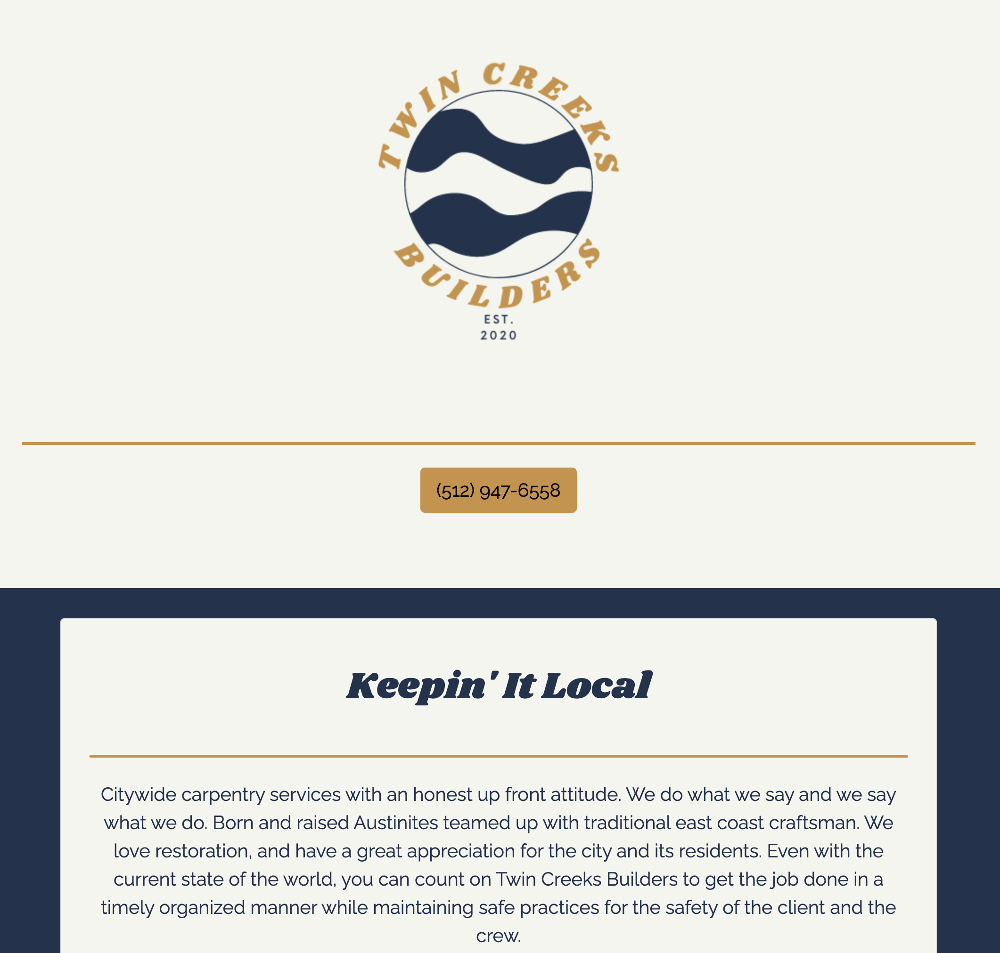

# 🛠 Twin Creeks Builders 🛠 
This website is a freelance project from a local carpentry company. It is designed for a simple and intuitive customer experience to help Twin Creeks grow their customer base. 
This was a collaborative effort with [Lili Clift](https://github.com/LiliCecilia23) 
# 🔍[Check it out!](https://ashlinhanson.github.io/twinCreeks/)🔎


## ⚙️ Use Instructions 
Click on the deployed link above and scroll the one page website and peruse their services and work portfolio.

## ⚙️ Installation
To run this locally, you will need to clone the repository to your local machine.

HTTPS:
````
$ git clone https://github.com/ashlinhanson/twinCreeks.git
````
SSH:
````
$ git clone git@github.com:ashlinhanson/twinCreeks.git
````
Once it has been cloned, open the index.html document in your preferred browser.

## ⚙️ Technologies Used
📌 Bootstrap 
📌 Canva 
📌 CSS3 
📌 HTML5

